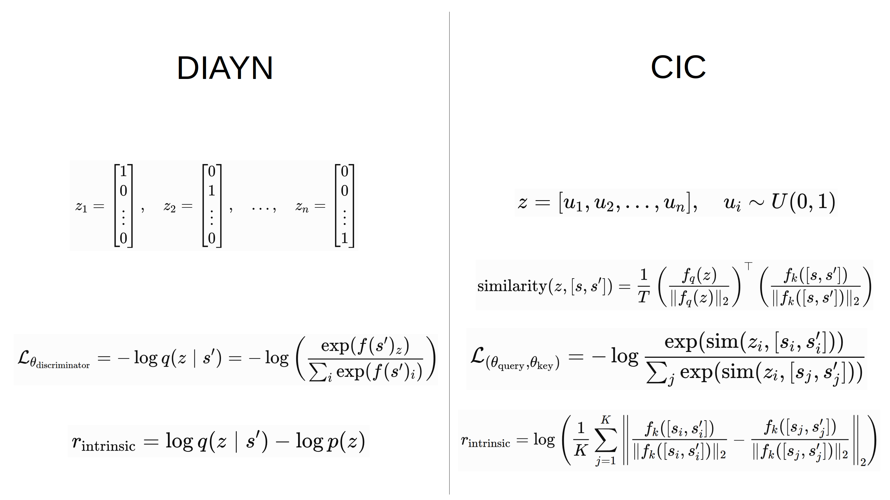
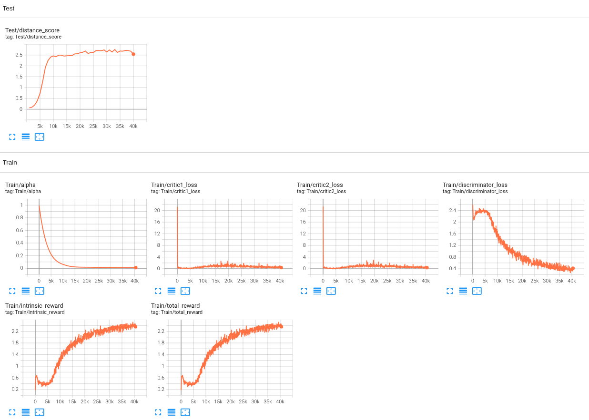

# Under-Construction
Implementing reward functions that lead to desired behaviors in reinforcement learning is not as straightforward as it seems. Unsupervised reinforcement learning enables agents to not only learn behaviors using intrinsic rewards without extrinsic rewards, but also acquire fundamental skills that can be used to perform desired behaviors. Diversity Is All You Need (DIAYN) and Contrastive Intrinsic Control (CIC) are unsupervised methods that discover diverse behaviors from a single training process. While DIAYN distinguishes discrete skills from observations, CIC optimizes the embedding similarity between observations and continuous skills. Before going into the details, CIC was proposed to improve the behavioral diversity of DIAYN, but my implementation of CIC performed worse than DIAYN, even though I implemented the loss and intrinsic reward to match the paper as closely as possible. This may indicate that I could have missed something in the implementation or the CIC results may be sensitive to specific training conditions. Nevertheless, I chose CIC as a comparison with DIAYN because it not only provides a new perspective that diverse behaviors can be learned through continuous skill representations, but also utilizes an interesting approach with an operation similar to Transformer attention.

In my implementation, both DIAYN and CIC use SAC as the backbone because they are methods that use additional loss functions and intrinsic rewards with the backbone algorithm, and SAC is selected due to its strong exploration capability among the algorithms I have implemented so far. DIAYN is based on the paper [*DIVERSITY IS ALL YOU NEED: LEARNING SKILLS WITHOUT A REWARD FUNCTION*](https://arxiv.org/pdf/1802.06070), and CIC is based on the paper [*CIC: Contrastive Intrinsic Control for Unsupervised Skill Discovery*](https://arxiv.org/pdf/2202.00161).

## Skill, Loss and Intrinsic Reward

### DIAYN
The discrete skill z is represented as a one-hot vector. The objective of the discriminator is to predict the correct skill when given a specific next state. Because the true probability of the correct skill given the specific next state is unknown before training, it is denoted as q instead of p. The next state is input to the discriminator network, which outputs logits for all possible skills so that softmax can be applied. Because it is desirable for each skill to show different behaviors by making the skill prediction accurate, intrinsic reward is just the loss function with the sign reversed. The probability of selecting z is included because, in theory, it seems to be intended to make all skills equally selected. However, in the actual implementation, it only acts as a constant that shifts the reward baseline.

### CIC
The continuous skill z is represented as a vector containing random values between 0 and 1. z is input to the query network to output a query embedding, which provides a more meaningful representation. The concatenation of the state and next state, which captures state changes, is input to the key network as well. To compute similarity, L2 norm is applied to make the vector magnitude equal to 1, so that similarity depends only on the direction. After that, the loss encourages higher similarity scores for correct query-key pairs and lower for incorrect pairs. 

intrinsic reward uses subtraction instead of dot product between key embeddings because it seems that comparing the distance between key embedding vectors rather than their directions encourages states to become more distinguishable. L2 norm is used twice: one is to make the vector magnitude equal to 1, and the other is to measure the distance between two vectors, so the purposes are different. If all distances are summed, the distances to faraway neighbors can dominate, leading to weak learning signals. Therefore, only the k nearest neighbors are selected to maximize the distances between the current embedding and the k nearest neighbors.

## DIAYN Plot

